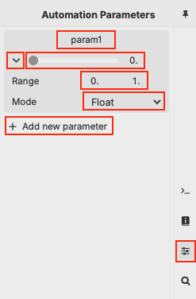

# DAW Overview
<!-- it would be great if we could link to a plugdata patch that covers all this information interactively -->
## Introduction
Along with functioning as a full standalone Pure Data flavor, plugdata can also run as a VST3, LV2, CLAP or AU plug-in within any DAW that can host those plug-in types.

## Adding plugdata to your DAW project
Adding plugdata to your project is the same as adding any plug-in to your project. plugdata has two plug-in types because most DAWs need plug-ins to be defined by the data the can receive and output. While these categories won't affect your experience inside the plugdata canvas, it will affect the data that the DAW will allow the plugin to receive and the data that the DAW will allow to be output:
- `plugdata` is intended to receive MIDI, output MIDI, and output audio. Use this type if your DAW has MIDI and Instrument tracks. This type is intended to generate MIDI data, process MIDI data, and receive MIDI data from the DAW to then produce audio.
- `plugdata-fx` processes audio data and generates audio data. Use this for audio tracks, or place this plug-in **after** a software instrument (or audio-generating `plugdata` instance).

For details on the specific implementation of plugdata plug-ins for specific DAWs, see the links below. This section will be updated as more DAWs are investigated and reported back from the plugdata community.
- [Ableton Live](./DAW-Specifics/plugdata-in-Ableton-Live.md)
- [Ardour](./DAW-Specifics/plugdata-in-Ardour.md)
- [Bitwig Studio](./DAW-Specifics/plugdata-in-Bitwig-Studio.md)
- [FL Studio](./DAW-Specifics/plugdata-in-FL-Studio.md)
- [Logic](./DAW-Specifics/plugdata-in-Logic.md)
- [Reaper](./DAW-Specifics/plugdata-in-Reaper.md)
- [Studio One](./DAW-Specifics/plugdata-in-Studio-One.md)

## Creating/Editing Patches in the DAW
For many DAWs, once you place plugdata on a track, you should be able to operate plugdata as you would the standalone version. 

Some DAWs need to explicitly be told to send keyboard data to the plug-in window so that plugdata can be edited/objects can be instantiated. This is true especially when using plugdata with [Ardour](https://ardour.org/) or [REAPER](https://www.reaper.fm/) on the Mac.

- In Ardour, click on the keyboard icon in the upper right corner of the plugin window:

    

- In REAPER, enable the "Send all keyboard input to plug-in" option in the FX menu of the plugin window:

    

Try this if your keyboard input in the plugin window doesn't appear to work. With those options, plugdata's usual keyboard shortcuts should all work normally, and you should be able to edit object names, properties, parameter names etc. without any problems.

## Audio I/O

The `[adc~]` and `[dac~]` objects are used to handle audio IO. Make sure DSP is enabled, and the master volume is on.

## MIDI I/O <!-- it would be VERY useful to link to link to the pd file midi-help.pd here -->
Use the MIDI objects of Pd to receive and send MIDI data to and from your plugdata plug-in. Only `plugdata` (*not* `plugdata-fx`) can handle MIDI I/O.
- MIDI Input
    - `[notein]` - MIDI note input
    - `[ctlin]` - MIDI CC input
    - `[bendin]` - MIDI pitchbend controller input
    - `[pgmin]` - program change message input
    - `[touchin]` - channel aftertouch input
    - `[polytouchin]` - polyphone aftertouch input
    - `[midiin]` - raw MIDI byte by byte input (no real-time messages)
    - `[midirealtimein]` - real-time messages input
    - `[sysexin]` - system exclusive messages
- MIDI Output
    - `[noteout]` - MIDI note output
    - `[ctlout]` - MIDI CC output
    - `[bendout]` - MIDI pitchbend controller output
    - `[pgmout]` - program change message output
    - `[touchout]` - channel aftertouch output
    - `[polytouchout]` - polyphone aftertouch output
    - `[midiout]` - raw MIDI byte by byte output (no real-time messages)
    
## Communicating with the DAW

### Automatable Parameters

Add automatable parameters to your plugdata code with the Automation Parameters Panel (right-hand side of the screen, third tab from the top).

To create a new parameter, click "Add new parameter". From here you can edit the parameter's properties. Click on the disclosure triangle next to the slider to see all of the properties.
- Name - Click on the default parameter name to set the parameter name. 
- Range - Set the value range you want the DAW to display. This will also be the value range that is sent to plugdata from the DAW or the parameter's slider.
- Mode - Set the mode for the incoming parameter values: floating point values, integer values, floating point logarithmic curve, floating point exponential.

When you create a new parameter, it should then appear in the DAW as an automatable parameter on your plugdata track. You may need to move the parameter's slider for the DAW to recognize the parameter, and write in automation for it to stay visible in the DAW.

To add the parameter to your canvas, click and drag the parameter module onto the canvas. This creates the `[param]` object, which is exclusive to plugdata, and gives it an argument that matches the parameter's name. 

This object receives any automation that is written into the DAW for that parameter.

Write automation data to the DAW for the named parameter by sending data to the `[param]` object.

## Transport Information
The `[playhead]` object can be used to receive details about the DAW project, as well as information about the current state of the DAW project. Like `[param]`, `[playhead]` is unique to plugdata and only functions in the plugin form of plugdata.

The `[playhead` object outputs the following information from the following outlets:

0. Play status (float) - 1 for playing, 0 for stopped
1. Recording status (float) - 1 for recording, 0 if not
2. Loop segment beginning and end measures (list) - start and end point of a defined loop portion of the timeline, if in loop mode in the DAW. Outputs 0 if not in loop mode.
3. Edit location (float) - location of editing point
4. Framerate (float) - Project framerate
5. Tempo (float) - Tempo in beats-per-minute (BPM)
6. Last bar (float) - last bar of the project
7. Time signature (float) - Number of beats per measure as defined in the key signature of the project
8. Current time of playhead (list) - Time point of the playhead in
    1. Quarter notes
    2. Samples
    3. Seconds